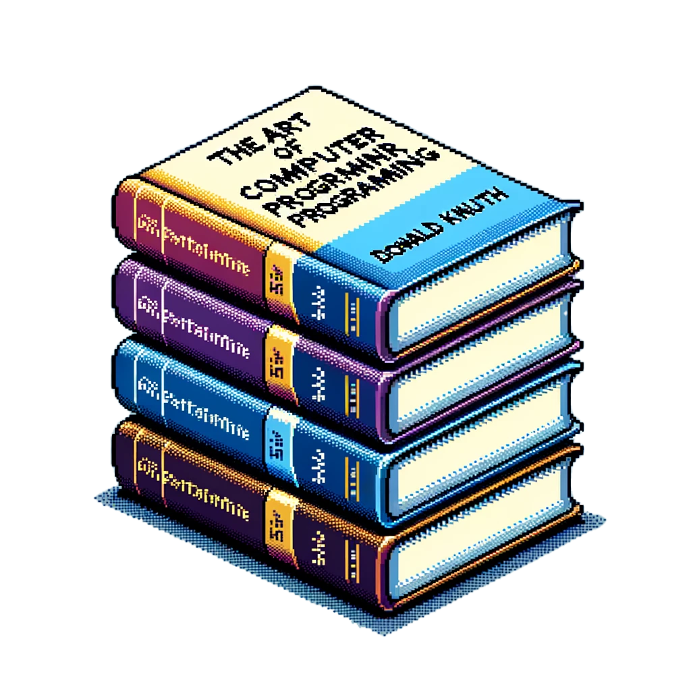

# Language Grammar

Basic Types

    String: A sequence of characters enclosed in double quotes.
        Example: string := "Hello, world!"

    Number: An integer or floating-point number.
        Integer Example: integer := 42
        Float Example: float := 3.14

    Boolean: A true or false value.
        Example: boolean := true | false

Identifiers

    Identifiers: Names used for variables, functions, structs, sagas, etc., starting with a letter or underscore, followed by letters, digits, or underscores.
        Example: ident := [a-zA-Z_][a-zA-Z0-9_]*

Structs

    Definition: Declares a new data structure with a fixed set of fields.
        Syntax: struct := "struct" ident "{" { field_def } "}"
        Field Definition: field_def := ident ":" type
    Implementation: Associates actions (functions) with a struct.
        Syntax: impl := "impl" ident "{" { action_def } "}"
        Action Definition: action_def := "action" ident "(" [param_list] ")" ["[" effects "]"] "->" type "{" ... "}"

Actions

    Actions are functions with potential side effects, explicitly declared.
        Syntax: action := "action" ident "(" [param_list] ")" ["[" effects "]"] "->" type "{" ... "}"

Sagas

    Sagas: Define complex workflows, potentially involving multiple actions, with an explicit export block for outcomes.
        Syntax: saga := "saga" ident "{" ... "}" "exports" "{" export_def "}"

Actors

    Actors: Concurrency primitives handling messages.
        Syntax: actor := "actor" ident "{" "state:" type "," { receive_def } "}"
        Receive Definition: receive_def := "receive" "(" ident ":" type ")" "{" ... "}"

Import and Export

    Import: Brings definitions from another file into the current namespace.
        Syntax: import := "import" "{" { ident } "}" "from" string
    Export: Makes definitions available to other files.
        Syntax: export := "export" ident { "," ident }